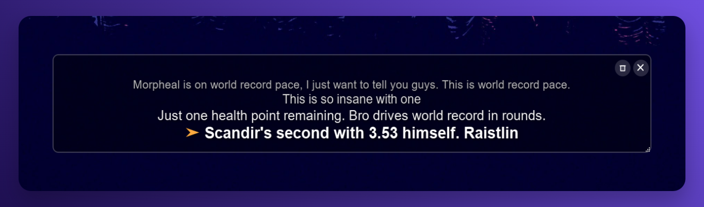

# Real-Time Captions

> [!CAUTION]
> **Experimental / Personal Use Only**
>
> I built the architecture and mapped out the logic for this project myself, but I let an AI handle the actual coding. It’s a "vibe coded" experiment meant for my own personal use, so it definitely isn't production-ready. Use it at your own risk!

## Table of Contents

- [Overview](#overview)
- [Showcase](#showcase)
- [Getting Started](#getting-started)
- [Usage](#usage)
  - [GUI (Graphical Interface)](#gui-graphical-interface)
  - [Worker (Background Process)](#worker-background-process)
- [Command-Line Arguments](#command-line-arguments)
- [Convenience Script (start.vbs) for Windows](#convenience-script-startvbs-for-windows)
- [Interacting with the Subtitle Window](#interacting-with-the-subtitle-window)
- [Recommendations for Lower-End Systems](#recommendations-for-lower-end-systems)
- [Core Technologies](#core-technologies)
- [License](#license)

## Overview

**"Real-Time Captions"** provides real-time captions from system audio. This application not only transcribes spoken content but also automatically translates it into English from various languages, even when background music is present.

The robust translation feature is ideal for understanding content from non-English sources, such as live streams (e.g., Twitch streamers), foreign-language movies or shows, and international online meetings. It supports a wide array of languages for translation. For a comprehensive list of supported language codes, please refer to the [--language argument documentation](#command-line-arguments).
While powerful, it's important to note that automatic translation is not always 100% accurate, and its effectiveness can vary depending on audio quality and speech complexity.

All transcription and translation capabilities are powered by **local models**. This means the application operates entirely _offline_, ensuring user privacy and offering a completely free solution without reliance on external APIs or services.

Under the hood, **"Real-Time Captions"** uses `faster-whisper` for efficient speech-to-text, `PyQt6` for its graphical user interface, and `torch`/`transformers` for its AI models. A worker process is always spawned. In GUI mode, this worker communicates via Inter-Process Communication (IPC) to send captions to the UI. When running in standalone worker mode (`--worker`), the worker prints captions directly to the console.

Please be aware there's an inherent **delay of approximately 2-3 seconds** between spoken audio and its transcription appearing.

## Showcase

Here's an example of the real-time captions in action:



## Getting Started

To get started with Real-Time Captions, follow these steps:

1.  **Clone the repository**:

```bash
git clone https://github.com/savander/real-time-captions.git
cd real-time-captions
```

2.  **Install `uv`**: If you don't have `uv` installed, follow the instructions [here](https://docs.astral.sh/uv/getting-started/installation/).

3.  **Install dependencies**: Once `uv` is ready, install the project dependencies:

```bash
uv sync
```

4.  **Launch the application**:

```bash
uv run real-time-captions
```

## Usage

### GUI (Graphical Interface)

Launch the application with its graphical user interface:

```bash
uv run real-time-captions
```

You can customize the experience by specifying a language or model size:

```bash
uv run real-time-captions --language en --model-size base
```

Setting the `--language` argument forces the AI to transcribe in the specified language. This can improve performance as the AI does not need to detect the language for each transcription.

### Worker (Background Process)

For background tasks or debugging without the GUI, run the transcription worker process:

```bash
uv run real-time-captions --worker
```

Similar to the GUI, the worker accepts language and model options:

```bash
uv run real-time-captions --worker --language pl --cpu
```

Setting the `--language` argument forces the AI to transcribe in the specified language. This can improve performance as the AI does not need to detect the language for each transcription.  
For a comprehensive list of command-line options and available language codes, use `uv run real-time-captions --help`.

### Command-Line Arguments

You can customize the application's behavior using the following command-line arguments:

| Argument           | Short | Description                                                                                      | Choices                                                                                                                                                                                                                                                                                                                                                                                                                                                                                                                                                                                                                                          | Default     |
| :----------------- | :---- | :----------------------------------------------------------------------------------------------- | :----------------------------------------------------------------------------------------------------------------------------------------------------------------------------------------------------------------------------------------------------------------------------------------------------------------------------------------------------------------------------------------------------------------------------------------------------------------------------------------------------------------------------------------------------------------------------------------------------------------------------------------------- | :---------- |
| `--language`       | `-l`  | Set the language for transcription.                                                              | `af`, `am`, `ar`, `as`, `az`, `ba`, `be`, `bg`, `bn`, `bo`, `br`, `bs`, `ca`, `cs`,`cy`, `da`, `de`, `el`, `en`, `es`, `et`, `eu`, `fa`, `fi`, `fo`, `fr`, `gl`, `gu`, `ha`, `haw`, `he`, `hi`, `hr`, `ht`, `hu`, `hy`, `id`, `is`, `it`, `ja`, `jw`, `ka`, `kk`, `km`, `kn`, `ko`, `la`, `lb`, `ln`, `lo`, `lt`, `lv`, `mg`, `mi`, `mk`, `ml`, `mn`, `mr`, `ms`, `mt`, `my`, `ne`, `nl`, `nn`, `no`, `oc`, `pa`, `pl`, `ps`, `pt`, `ro`, `ru`, `sa`, `sd`, `si`, `sk`, `sl`, `sn`, `so`, `sq`, `sr`, `su`, `sv`, `sw`, `ta`, `te`, `tg`, `th`, `tk`, `tl`, `tr`, `tt`, `uk`, `ur`, `uz`, `vi`, `yi`, `yo`, `zh`, `yue` | None        |
| `--model-size`     | `-m`  | Override automatic model size detection (e.g., tiny, base, small, medium, large-v3)              | `tiny`, `tiny.en`, `base`, `base.en`, `small`, `small.en`, `medium`, `medium.en`, `large`, `large-v1`, `large-v2`, `large-v3`                                                                                                                                                                                                                                                                                                                                                                                                                                                                                                                    | None        |
| `--cpu`            | `-c`  | Force CPU usage even if a GPU is available.                                                      |                                                                                                                                                                                                                                                                                                                                                                                                                                                                                                                                                                                                                                                  | `False`     |
| `--max-cpu-ram-gb` | `-r`  | Restrict perceived RAM in GB for CPU model selection (e.g., 8, 16).                              |                                                                                                                                                                                                                                                                                                                                                                                                                                                                                                                                                                                                                                                  | `None`      |
| `--task`           | `-t`  | Set the task for the transcription engine: 'translate' or 'transcribe'. Defaults to 'translate'. | `translate`, `transcribe`                                                                                                                                                                                                                                                                                                                                                                                                                                                                                                                                                                                                                        | `translate` |
| `--microphone`     | `-i`  | Use microphone instead of loopback device for audio capture.                                     |                                                                                                                                                                                                                                                                                                                                                                                                                                                                                                                                                                                                                                                  | `False`     |

## Convenience Script (start.vbs) for Windows

Windows users can utilize `start.vbs` to launch the GUI application without a visible command prompt window. This VBScript simply executes the `uv run real-time-captions` command in the background.

For quick access, you can create a shortcut to `start.vbs` and place it on your desktop or in your Start Menu.

Should you wish to include default arguments (e.g., `--language en --model-size base`), you can edit the `start.vbs` file in any text editor. Locate the line:  
`WshShell.Run "uv run real-time-captions", 0, False`  
and modify it to include your desired arguments, for example:  
`WshShell.Run "uv run real-time-captions --language en --model-size base", 0, False`

**Note**: `start.vbs` currently does not function correctly when launched via PowerToys Run.

## Interacting with the Subtitle Window

The subtitle window offers various customization options through mouse interactions:

| Action                        | Shortcut                                | Description                                    |
| :---------------------------- | :-------------------------------------- | :--------------------------------------------- |
| **Move Window**               | Click and drag _anywhere on the window_ | Repositions the window on your screen.         |
| **Resize Window**             | Drag any edge or corner                 | Adjusts the window's size.                     |
| **Change Font Size**          | Scroll wheel                            | Increases or decreases the subtitle font size. |
| **Adjust Background Opacity** | Ctrl + Scroll wheel                     | Modifies the background opacity.               |
| **Control Number of Lines**   | Shift + Scroll wheel                    | Adjusts how many subtitle lines are displayed. |

## Recommendations for Lower-End Systems

For users with systems that have limited resources (such as older CPUs, less RAM, or integrated GPUs), optimizing performance is key. Consider these options:

**Specify the language**: If the source language is known, explicitly setting the `--language` argument (e.g., `--language en`) can improve performance by bypassing the automatic language detection process, which can be resource-intensive.

```bash
uv run real-time-captions --language en
```

**Utilize smaller models**: Models like `tiny` or `base` are significantly less resource-intensive compared to `small`, `medium`, or `large`. _However, 'tiny' and 'base' models offer lower transcription quality. Aim for the 'small' model if your system resources permit for better accuracy._

```bash
uv run real-time-captions --model-size tiny
```

**Force CPU usage**: In some cases, forcing the application to use the CPU, even if a low-end or integrated GPU is present, might provide more stability, though it can sometimes result in slower performance.

```bash
uv run real-time-captions --cpu
```

**Limit CPU RAM**: If you have abundant RAM but want to influence the model selection on the CPU to favor smaller models, you can restrict the perceived RAM. This helps the system choose models more appropriate for your actual usage.

```bash
uv run real-time-captions --max-cpu-ram-gb 8
```

## Core Technologies

The project relies on these key technologies:

- **Speech-to-Text**: [faster-whisper](https://github.com/SYSTRAN/faster-whisper) (models from [Hugging Face](https://huggingface.co/Systran/faster-whisper-large-v3))
- **User Interface**: [PyQt6](https://www.riverbankcomputing.com/software/pyqt/)
- **AI/ML Models**: [torch](https://pytorch.org/), [transformers](https://huggingface.co/docs/transformers/)
- **Package Management**: [uv](https://astral.sh/uv)

## License

This project is licensed under the MIT License - see the [LICENSE](LICENSE) file for details.
